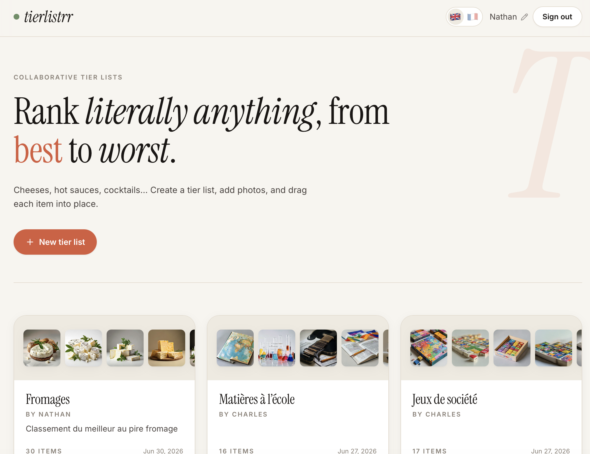
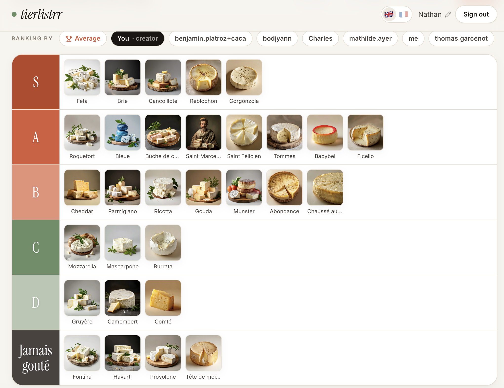

# tierlistrr

Create, share and rank **anything** as a tier list — cheeses, hot sauces,
cocktails, movies… Each tier list is a shared subject: the creator adds the
items, and **every signed-in participant builds their own ranking** by dragging
items into tiers. Anyone can browse the results (read-only), compare each
participant's ranking, and see the aggregated **average leaderboard**.

Self-hostable, no third-party account required, a single SQLite file for storage.

**[🔗 Live demo](https://tierlistrr.limperiam.com)** · [MIT License](./LICENSE) · PRs welcome

<a href="https://www.buymeacoffee.com/AzRoDoRzA" target="_blank"></a>

> 🌍 **Speak another language?** Adding one is the easiest way to contribute — no
> code required, just a JSON file. See [_Add a language_](#internationalization)
> below or open a [🌍 language issue](https://github.com/nathan71370/tierlistrr/issues/new?template=add_a_language.yml).

## Screenshots

|  |  |
| --- | --- |
|  |  |

## Features

- 🧱 **Tier lists** with custom tiers (label + color) and a drag-and-drop board
- 👥 **Multi-user** — one shared list, one ranking per participant
- 🏆 **Average leaderboard** — aggregated consensus ranking across participants
- 🔗 **Public & shareable** — anyone can view via a link; sign in to participate
- 🔑 **Passwordless auth** — email one-time code (better-auth)
- 🖼️ **Images** — upload your own, or **generate them with AI**
  (item names via an LLM, pictures via Pollinations), processed in the background
- 🌍 **i18n** — fully translated via message files; switch language with the flag
  picker (English & French included, easy to add more)
- 📦 **Self-hosted** — Docker / Docker Compose, single data volume

## Tech stack

- [Next.js](https://nextjs.org) (App Router) + React + TypeScript
- [Tailwind CSS](https://tailwindcss.com) v4
- [Drizzle ORM](https://orm.drizzle.team) on **libSQL / SQLite** (single local file)
- [@hello-pangea/dnd](https://github.com/hello-pangea/dnd) for drag-and-drop
- [better-auth](https://better-auth.com) (email OTP) · [next-intl](https://next-intl.dev) (i18n)
- AI (optional): [Groq](https://groq.com) (OpenAI-compatible LLM) + [Pollinations](https://pollinations.ai) (images)

## Quick start (development)

```bash
git clone https://github.com/nathan71370/tierlistrr.git
cd tierlistrr
npm install
cp .env.example .env.local   # then edit (see Configuration)
npm run dev                  # http://localhost:3000
```

The database and uploads directory are created automatically on first run under
`./data` (git-ignored). There is **no migration step** — the schema is applied
idempotently at startup.

> Without SMTP configured, sign-in OTP codes are printed to the server logs, so
> you can test authentication locally without an email provider.

## Configuration

All configuration is via environment variables. Copy `.env.example` and fill in
what you need — everything is optional except `BETTER_AUTH_SECRET` in production.

| Variable | Purpose | Default |
| --- | --- | --- |
| `BETTER_AUTH_SECRET` | **Required in production** — random secret (`openssl rand -base64 32`) | — |
| `BETTER_AUTH_URL` | **Public app URL** — must match the browser origin (cookies / CSRF). In `compose.yaml` it is auto-derived from `TIERLISTRR_HOST` | inferred from request |
| `BETTER_AUTH_TRUSTED_ORIGINS` | Extra trusted origins, comma-separated (e.g. apex + `www`) | — |
| `AUTH_ALLOWED_EMAILS` | Sign-in allowlist — emails and/or `@domains`, comma-separated. Empty = open | — |
| `DATA_DIR` | Directory for the SQLite database **and** uploaded images | `./data` |
| `DATABASE_URL` | Explicit libSQL URL (e.g. `file:/var/lib/tierlistrr/app.db`) | derived from `DATA_DIR` |
| `PORT` | HTTP port | `3000` |
| `SMTP_HOST` / `SMTP_PORT` | SMTP server for OTP emails (Gmail: `smtp.gmail.com` / `587`) | — |
| `SMTP_USER` / `SMTP_PASS` | SMTP credentials (Gmail: address + **app password**) | — |
| `SMTP_FROM` | From address for emails | `SMTP_USER` |
| `GROQ_API_KEY` | Enables AI item generation (free key at [console.groq.com](https://console.groq.com)) | — |
| `GROQ_MODEL` | LLM model | `llama-3.3-70b-versatile` |
| `GROQ_BASE_URL` | OpenAI-compatible endpoint | `https://api.groq.com/openai/v1` |
| `POLLINATIONS_TOKEN` | Pollinations secret key `sk_…` (higher image rate limits, server-side) | — |
| `POLLINATIONS_BASE_URL` | Image service base URL | `https://image.pollinations.ai` |
| `IMAGE_CONCURRENCY` | Parallel background image downloads | `2` |
| `TIERLISTRR_HOST` | Public hostname used by the Traefik router rule in `compose.yaml` | `tierlistrr.example.com` |

### Authentication & email

Auth is passwordless: users enter their email and receive a 6-digit code. To send
real emails, configure SMTP. With Gmail / Google Workspace, use
`smtp.gmail.com:587`, your address as `SMTP_USER`, and an
[App Password](https://myaccount.google.com/apppasswords) as `SMTP_PASS`
(the regular account password won't work). Without SMTP, codes are logged to the
container output.

> **Behind a reverse proxy?** Set `BETTER_AUTH_URL` to your public URL (e.g.
> `https://tierlistrr.example.com`) — it must match the browser origin, otherwise
> sign-out and other actions fail with `403 Invalid origin`. With the provided
> `compose.yaml` this is handled automatically as long as `TIERLISTRR_HOST` is set.

To make the app **invite-only**, set `AUTH_ALLOWED_EMAILS` to a comma-separated
list of allowed addresses and/or domains (e.g.
`alice@example.com, @yourteam.com`). Anyone not on the list can't request a code
or create an account. Leave it empty for an open instance.

### AI images (optional)

With `GROQ_API_KEY` set, a **Generate** button appears: the LLM proposes items
for the list's topic, and each gets an image from Pollinations. Items appear
instantly and are usable right away; images are downloaded to disk in the
background. No key → the feature is simply hidden and the app works normally.

## Self-hosting with Docker

The repo ships a multi-stage `Dockerfile` (Next.js standalone, non-root) and a
`compose.yaml`. Persist the named volume `tierlistrr-data` (mounted at `/data`) —
it holds the SQLite database and uploaded images.

```bash
BETTER_AUTH_SECRET=$(openssl rand -base64 32) docker compose up -d --build
```

The provided `compose.yaml` is ready for [Komodo](https://komo.do) and includes
[Traefik](https://traefik.io) labels. **Nothing domain-specific is hardcoded** —
the router host comes from `TIERLISTRR_HOST` and all secrets from the
environment, so you can deploy straight from a git-linked stack without editing
the file. Set at least `BETTER_AUTH_SECRET`, `TIERLISTRR_HOST` and
`BETTER_AUTH_URL` in your platform's environment. Not using Traefik? Comment out
the `networks`/`labels` and uncomment the `ports` mapping.

## Internationalization

UI strings live in `messages/<locale>.json` (`en` and `fr` included). The active
language is chosen with the flag switcher in the header and stored in a cookie.

**Add a language:**

1. Copy `messages/en.json` to `messages/<code>.json` and translate the values.
2. Add the locale to `src/i18n/config.ts` (`locales` + `localeMeta` with a label
   and a flag emoji).

That's it — PRs adding languages are welcome.

## Project structure

```
src/
  app/                 # routes (home, /t/[slug], API routes)
  components/          # UI + board + auth components
  db/                  # Drizzle schema + libSQL client (idempotent schema init)
  lib/                 # data access, server actions, AI, image queue
  i18n/                # next-intl config, request, locale switch action
messages/              # translation catalogs (one JSON per locale)
```

## Contributing

Issues and pull requests are welcome — new languages, features, or fixes. If you
find this useful, a ⭐ on the repo helps a lot.

## Support

If tierlistrr saves you time, you can support development:

<a href="https://www.buymeacoffee.com/AzRoDoRzA" target="_blank"></a>

## License

[MIT](./LICENSE) © Nathan Mercier
